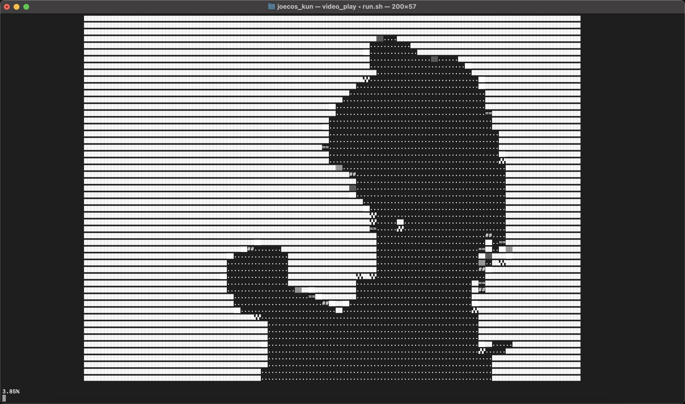
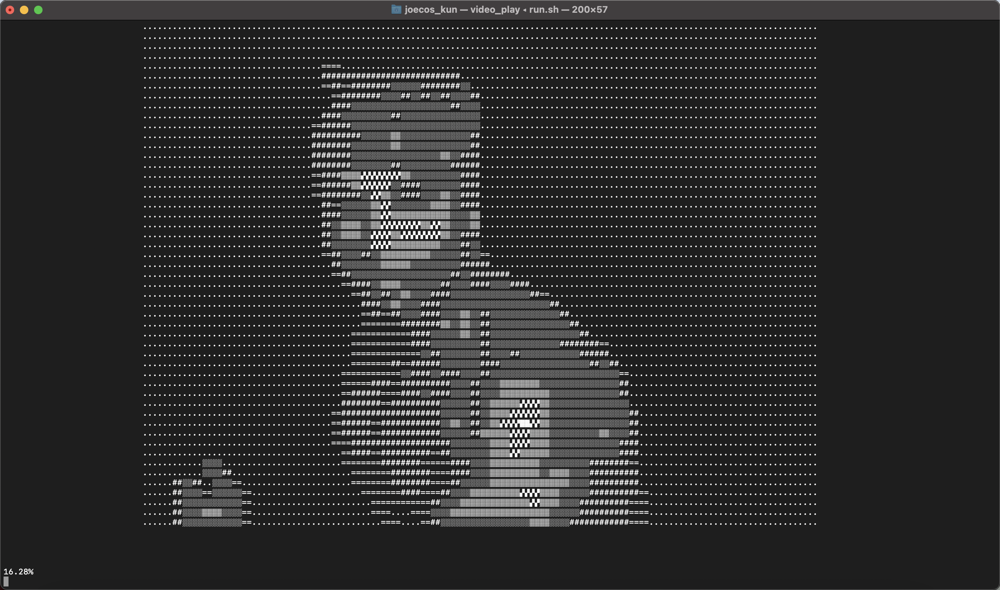

# VideoConvert
## Intro
Very strange video converter, converts .mp4 video into text and displays. Works fine on mac and linux, and perhaps windows if you use raw scripts in the ./scripts folder :^)

## Tips
Before using the converter, please make sure you've got the .mp4 file in the same folder with run.sh, or it won't work. Only one MP4 file at a time. The converted text-frames would be huge, so don't convert MP4 videos that's too big.

Due to unknown reasons, you have to run ./run.sh twice to enter the menu. When pipenv installs the environment, it just breaks the progress and quit. So you have to run it again to enter.

You can only use KeyBoardInterrupt to exit when playing video, run ./run.sh again to re-enter the main menu.

## Future
I may update this program, so you can use it with shell commands.

## Examples
### example_01

### example_02

